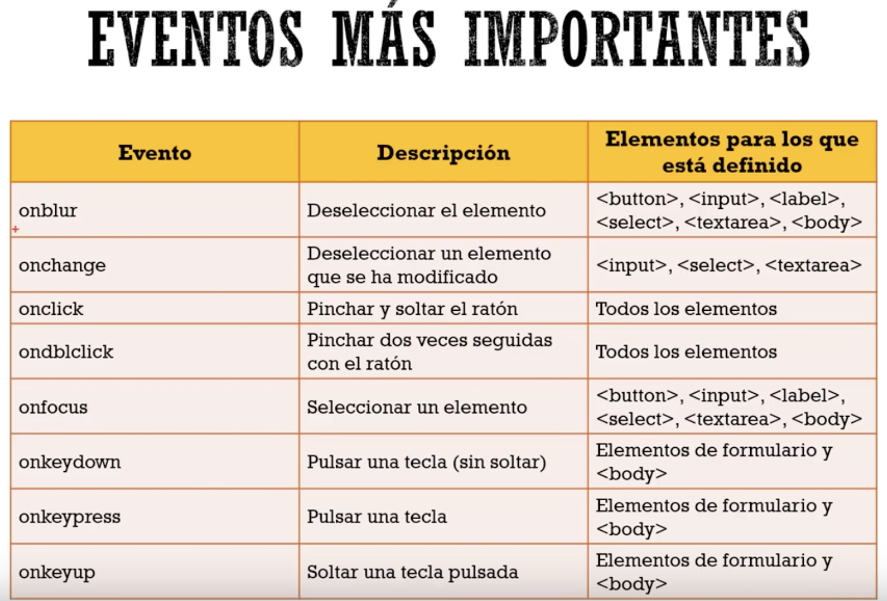

# Learning JS

## First approach

    - Arrays
    - Objects
    - Arrow functions
    - Expressions and operators
    - 'Igualdad estricta'
    - return sentence
    - promises
    - Methods:
        - split()
        - padStart()
        - padEnd()
        - length()
        - every


# JavaScript Ya !

## Values

we can start a value with underscore or a letter.

```
let _value1;
```
```
let value1;
```
we can declare various values in one line
```
let day, month, year;
```
hay que nombrar nuestras variables de forma representativa

para imprimir una variable usamos el objeto document y llamamos la funcion write
```
document.write(_value1);
```
Tipos de variables

Primitivos

    - String 🆒
    - Boolean ✔️❌
    - Number 4️⃣4️⃣
    - Undefined
    - Boolean
    - Null
    - Symbol


### Data Input

Para ingresar datos por el teclado podemos usar la función prompt
```
let input;

input = prompt('type something: ');
```

## Eventos

Principal Events on JS

