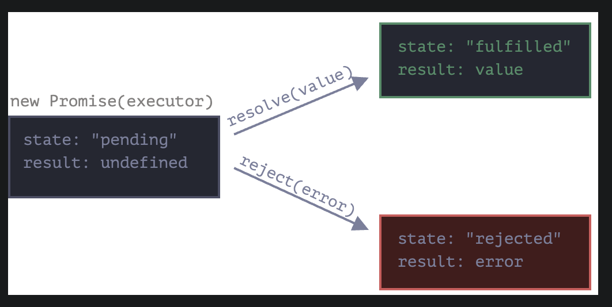

# promises
A promise is something that you will share with other functions no matter when.

Artist analogy:
producer (of data)
fans (subscribers)
wish list (promise)

An artist promises to the fans the next new songs. Fans get subscribe to the waiting list.

syntax

```
// Normal syntax
let promise = new Promise(function(resolve,reject){
    /// Executor (producer of data)
});

// Using arrow function
const promise1 = new Promise((resolve, reject) => {

});
```

The function is called the executor (which will produce the data), its args are resolve and reject that are callbacks (a function called by another function) those callback are provided by JS. our code is inside the executor.

promise callbacks:

resolve (value) - if state : fulfilled (success), result: value.
reject (value) - if state : rejected (failure), result: error.

So the executor is executed automatically if the task is done successfully call resolve. if the task is done wrongly call reject.

the promise object has properties:

promise: {
    state: pending,
    result: undefined
}



## then & catch
The fans can subscribe to the result by this methods.

### then
syntax
```
promise.then(
    function(result){
        /* handle a successful result*/
    }.
    function(error){
        /* handle an error */
    }
);
```

if we only want successful answers:
```
let promise = new Promise(resolve => {
  setTimeout(() => resolve("Done!"), 1000);
});

promise.then(alert); // shows "done!" after 1 second.
```

if we only want errors we can use null as first argument .then(null, errorHandlingFunction) or .catch(errorHandlingFunction):

```
let promise = new Promise((resolve, reject) => {
  setTimeout(() => reject(new Error("Ups!")), 1000);
});

// .catch(f) is equal to promise.then(null, f)
promise.catch(alert); //shows "Error: Ups!" after 1 second.
```


## Promise Class
## methods
### statics

    Promise.all(iterable) --> creates an array resolved with all the results it's rejected if one of them is rejected.
    Promise.allSettled(iterable) -->  creates an array with all the results.
    Promise.any(iterable)
    Promise.race(iterable)
    Promise.resolve(value)
    Promise.reject(reason)

### Isntance

    promise.then(onFulfilled, onRejected)
    promise.catch(onRejected)
    promise.finally(onFinally) --> clean